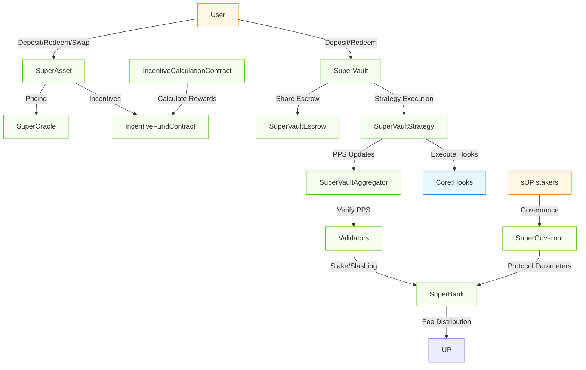

# Overview

Superform v2 Periphery is a suite of products built on top of the Superform core contracts, providing user-facing savings wrappers, validator-secured vault systems, and governance infrastructure.

This document provides technical details, reasoning behind design choices, and discussion of potential edge cases and risks in Superform's v2 periphery contracts.

The periphery consists of the following components:

- **SuperAssets**: Meta-vault token implementation with incentive mechanisms
- **SuperVaults**: Validator-secured ERC7540 vault system with flexible strategies
- **VaultBank**: Chain-specific deposit contracts for cross-chain asset management
- **UP Token & Governance**: Protocol token and governance infrastructure
- **SuperBank**: Protocol fee and resource coordination
- **SuperGovernor**: Governance implementation and contract registry

## Repository Structure

```
src/
├── periphery/          # Extended protocol ecosystem
│   ├── SuperAsset/     # Meta-vault token implementation
│   ├── SuperVault/     # Validator-secured vault system
│   ├── UP/             # Protocol token implementation
│   ├── VaultBank/      # Chain-specific deposit contracts
│   ├── Bank.sol        # Abstract hook execution contract
│   ├── SuperBank.sol   # Protocol fee and resource coordination
│   ├── SuperGovernor.sol # Governance implementation
│   ├── interfaces/     # Periphery interface definitions
│   ├── libraries/      # Utility libraries for periphery
│   └── oracles/        # Price feed implementations
└── vendor/             # Vendor contracts (NOT IN SCOPE)
```

## Superform Periphery Key Components

The following diagram illustrates how users interact directly with the periphery system and how the different components work together. Some components, like the SuperAssetFactory and VaultBank, are not included in this given comparative simplicity.



### SuperAssets

The SuperAssets system provides a layer of user-facing savings wrappers that package multiple SuperVault positions behind ERC-20 tokens. This system combines yield from underlying vaults with oracle-priced swaps and an incentive mechanism to create a streamlined user experience.

They currently implement an incentive model based on weighted deviation from target allocations:

- **Energy-Based Calculation**: Computes an "energy" score representing how far current allocations deviate from targets
  - Uses Manhattan Norm (Norm1) for allocation vector normalization
  - Employs a modified Euclidean Distance (without square root) for similarity measurement
  - Squares the deviation to penalize larger deviations more heavily

- **Ki-Weighting System**: Applies configurable importance weights to different assets to prioritize certain rebalancing actions

- **USD-Denominated Incentives**: Converts the calculated energy score into token incentives based on an exchange rate

- **Circuit Breakers**: Monitors price feeds for depegging (98%-102% threshold) or dispersion events (1% relative standard deviation) that pause operations

#### SuperAsset 

SuperAsset is the main ERC-20 implementation that serves as a meta-vault, managing deposits, redemptions, and swaps between assets. It integrates oracle pricing, circuit breakers, and incentive mechanisms to create risk-managed yield-generating tokens pegged to reference assets.

Key Points for Auditors:

- Asset Management:
  - Accepts ERC-20 tokens obtained from VaultBank (assumed with price feed) and ERC-7540 vault shares
  - Underlying token balance tracking and allocation calculations
  - Rebalancing of assets around target weights

- Price Circuit Breakers:
  - SuperOracle integration for reliable price feeds
  - Depeg guard implementation on the oracle
  - Dispersion threshold checks on the oracle
  - Actions disabled on circuit breaker activation

- User Operations:
  - Deposit/redemption flow, slippage protection, incentive calculation
  - Swap mechanism between supported assets
  - Fee collection and distribution logic

#### SuperAssetFactory

Factory contract for deploying new SuperAsset instances with standardized configurations. It provides a permissionless mechanism to create new meta-vaults for different reference assets.

Key Points for Auditors:

- Permissionless: anyone can create a new SuperAsset, ICC, and IFC pair. They could contain malicious assets. 

#### IncentiveCalculationContract (ICC)

Pure math helper contract that calculates rebalancing incentives by comparing live allocations to governance-set targets. It applies Ki weights to account for systemic importance and converts deviations into USD-denominated incentives.

Key Points for Auditors:

- Math Implementation:
  - Energy score calculation precision
  - Deviation curve implementation
  - Ki-weighting system and its implications
  - Potential edge cases in extreme market conditions

#### IncentiveFundContract (IFC)

Manages the reward budget and penalties for SuperAsset rebalancing. It distributes calculated incentives to arbitrageurs who help maintain allocations and collects penalties when allocations are worsened.

Key Points for Auditors:

- Fund Security:
  - Deposit/withdrawal control mechanisms
  - Balance tracking across multiple tokens
  - Circuit breaker integration

- Reward Distribution:
  - Calculation accuracy and rounding behavior
  - Fee splitting between insurance and incentives (default 40%)
  - Reward capping mechanisms
  - Prevention of incentive manipulation

#### Planned Future Enhancement

A proposed enhancement to the incentives model (to be implemented as new ICC/IFC contracts) would focus on controlling the Value Exchange Rate (VER) directly:

- **Value Exchange Rate (VER) Control**: Would directly manipulate the effective swap rate using the formula: $R = \frac{A_{in} P_{in} + I P_{I}}{A_{out} P_{out}}$, where $I$ represents incentives

- **Improved Similarity Metrics**: Would use Cosine Similarity Distance instead of modified Euclidean Distance to better handle allocation vector orientation

- **Sigmoid Function Mapping**: Would map similarity distances to a configurable VER range $[R_{min}, R_{max}]$ using a sigmoid curve for smooth transitions

- **Value Caps**: Would implement maximum incentive amounts to prevent excessive rewards/penalties on large trades

This enhanced mathematical framework would allow for more precise control over the market-driven equilibrium mechanism.

### SuperVaults

SuperVaults provide validator-secured ERC7540 vaults that can execute arbitrary hook-based yield strategies while ensuring deterministic pricing and withdrawal guarantees. The architecture solves the "vault trilemma" of flexibility, security, and usability.

#### SuperVault

The entrypoint vault contract that implements ERC7540 synchronous deposits and asynchronous redeems. Manages share accounting and serves as the user-facing component of the architecture.

Key Points for Auditors:

- Share Accounting:
  - Conversion between share amounts and underlying asset values at PPS
  - Fee accuracy and bypass conditions

- Security Mechanisms:
  - Access controls for administrative functions
  - Integration with strategy, escrow, and aggregator components
  - Delegation of operations to an operator for UX / integrations

#### SuperVaultStrategy

Executes hook bundles, tracks cost basis, queues/fulfills redemption requests, and enforces fee/slippage policies. It is the active component that interacts with external protocols.

Key Points for Auditors:

- Hook Execution:

  - Merkle validation of hook bundles against roots from the Aggregator (note that hooks can be malicious, the vault is not responsible for this given offchain PPS)
  - Atomicity of operations within bundles

  - Slippage protection during external protocol interactions
  
- Investment Tracking:
  - Cost basis calculation for accurate fee assessment
  - Cancellation logic with the escrow

#### SuperVaultEscrow

Holds user shares during the redemption process rather than burning them immediately, allowing users to cancel pending redemptions if needed and providing proof of ownership.

Key Points for Auditors:

- User Operations:
  - Record keeping of pending redemptions
  - Prevention of unauthorized withdrawals
  - Proper release conditions

#### SuperVaultAggregator

Single source of truth for Price-Per-Share (PPS) updates. Manages strategists, deploys new Vault/Strategy/Escrow triads, and can pause misbehaving strategies.

Key Points for Auditors:

- Price Oracle Mechanism:
  - PPS update frequency and limits
  - Manipulation resistance through threshold checks

- Strategist Management:
  - Primary strategist has full control over strategy operations
  - Secondary strategists can be added/removed by primary strategist
  - Superform-approved strategists can bypass primary strategist via SuperGovernor takeover
  - 7-day timelock for primary strategist changes proposed by secondary strategists

- Hook Validation System:
  - Global hooks root managed by governance with timelock
  - Strategy-specific hooks root managed by primary strategist
  - Guardian role can veto both global and strategy roots to prevent malicious hooks
  - Merkle tree leaves contain `abi.encode(hookArgs)` obtained via hooks' inspect function

#### Hook Root Veto Mechanism

The SuperVault system implements a dual-layer security mechanism for hook execution through vetoed hook roots:

**Veto Protection**: If either the global hooks root or a strategy's hooks root is vetoed (due to containing malicious calldata or malicious hooks), strategists cannot execute any hooks from those roots. This prevents execution of potentially harmful operations until the malicious content is removed.

**Strategy-Level Compliance**: Individual strategies can ban specific leaves (hook configurations) from the global root to maintain compliance or transparency requirements. For example, a strategy could permanently ban loop hooks or other operations that don't align with its investment mandate, even if those hooks remain valid in the global root.

This mechanism ensures that hook execution is always subject to both governance oversight and strategy-specific compliance controls.

- Factory Functionality:
  - Permissionless deployment of new vault triads
  - Initialization parameter validation
  - Integration with SuperBank for protocol coordination and fee collection

### UP + SuperBank + SuperGovernor

These contracts form the core governance, coordination, and incentive layers for the Superform periphery ecosystem.

#### UP Token

Utility and governance token for the Superform ecosystem. It enables staking for validators, governance participation rights, and protocol incentives. 

sUP is a SuperVault created for UP by the SuperVaultAggregator.

#### SuperGovernor

Central registry for all deployed contracts in the Superform periphery with role-based access control for system governance. It serves as the configuration hub for security parameters and protocol settings.

Key Points for Auditors:

- Contract Registry:
  - Central address registry for all periphery components
  - Role-based access control (SUPER_GOVERNOR_ROLE, GOVERNOR_ROLE, BANK_MANAGER_ROLE)
  - Secure mapping between contract identifiers and addresses

- Hook Security Management:
  - Merkle root management for SuperBank and VaultBank hooks
  - Timelocked root updates with 7-day delay
  - Hook registration and approval workflows

- Protocol Parameter Control:
  - Fee management for revenue share, performance fees, and swap fees
  - Validator registry and quorum requirements
  - PPS oracle configuration and updates
  - Upkeep cost management for protocol operations
  
#### SuperBank

Executes protocol revenue distribution and hook-based operations under governance control. Extends the base Bank contract with Merkle-verified hook execution.

Key Points for Auditors:

- Hook Execution:
  - Merkle-verified hook execution with proofs validated against SuperGovernor
  - Compound protocol operations via executable hooks
  - Security boundaries for hook execution permissions

- Revenue Distribution:
  - Distributes UP tokens between sUP stakers and treasury
  - Implements governance-controlled revenue share percentages
  - Handles transfer security for token movements
  
- Bank Manager Controls:
  - Role-based restrictions for sensitive operations
  - Role verification through SuperGovernor's access control

### VaultBank

VaultBank orchestrates cross-chain asset transfers through a unified contract that inherits from both VaultBankSource and VaultBankDestination abstractions. It implements Polymer (https://docs.polymerlabs.org/) for secure cross-chain messaging and proof validation.

The cross-chain workflow functions as follows:

1. On the source chain:
   - Assets are locked via `lockAsset()` by authorized executors
   - The system tracks locked amounts per user, token, and destination chain
   - Nonces are incremented to prevent transaction replay attacks
   - Events are emitted to facilitate cross-chain attestation

2. On the destination chain:
   - The relayer submits proofs of asset locking on the source chain
   - Proof validation confirms the authenticity of source-chain operations
   - SuperPosition tokens are minted as receipt tokens representing locked collateral
   - Each SuperPosition token is specific to a source chain and asset pair

3. For redemptions:
   - Users burn SuperPosition tokens on the destination chain
   - Asset unlock proofs are validated on the source chain
   - Original assets are unlocked and returned to users

Key Points for Auditors:

- Cross-Chain Security:
  - Strict nonce management across all chains to prevent replay attacks
  - Cryptographic proof validation using Polymer for message integrity
  - Cross-chain event correlation to ensure operation consistency

- SuperPosition Tokens:
  - Dynamically created ERC20 tokens with matching properties (name, symbol, decimals)
  - Controlled minting/burning strictly tied to verified cross-chain operations
  - Ownership restricted to the VaultBank contract exclusively
  - Supply management and accounting

- Role-Based Access Control:
  - Executors for initiating asset locks (contract-to-contract calls)
  - Relayers for submitting cross-chain proofs and distributing rewards
  - Bank manager for governing protocol-level operations
  - SuperGovernor-managed Merkle roots for hook execution validation

- Cross-Chain Operations:
  - Proof of deposit mechanisms
  - Redemption process against locked assets
  - Handling of liquidations or recovery events

## Areas of Interest

To ensure transparency and facilitate the audit process, the following points outline known issues and potential edge cases our team has identified:

### SuperAsset Incentive System

**Risk**:
- Incentive calculation complexity could lead to manipulation or gaming
- Circuit breaker failures could halt operations unexpectedly

**Mitigation**:
- Comprehensive mathematical review of energy calculations
- Multiple layers of circuit breaker validation
- Clear documentation of incentive mechanisms

### SuperVault Strategist Trust Model

**Risk**:
- Primary strategists have significant control over vault strategies
- Malicious hooks could be included in strategy execution

**Mitigation**:
- Guardian role can veto malicious hook roots
- 7-day timelock for strategist changes
- SuperGovernor takeover mechanisms for approved strategists

### VaultBank Cross-Chain Security

**Risk**:
- Cross-chain proof validation complexity
- Potential for replay attacks across chains

**Mitigation**:
- Strict nonce management and proof validation
- Polymer integration for secure cross-chain messaging
- Chain-specific validation mechanisms

### Oracle Dependencies

**Risk**:
- Price feed manipulation or failure could affect SuperAsset operations
- PPS oracle failures could impact SuperVault operations

**Mitigation**:
- Circuit breaker mechanisms for price deviations
- Multiple validation layers for PPS updates
- Fallback mechanisms for oracle failures

## Development Setup

### Prerequisites

- Foundry
- Node.js
- Git

### Installation

Clone the repository with submodules:

```bash
git clone --recursive https://github.com/superform-xyz/v2-contracts
cd v2-contracts
```

Install dependencies:

```bash
forge install
```

```bash
cd lib/v2-core/lib/modulekit/
pnpm install
```

Note: This requires pnpm and will not work with npm. Install it using:

```bash
curl -fsSL https://get.pnpm.io/install.sh | sh -
```

Copy the environment file:

```bash
cp .env.example .env
```

### Building & Testing

Build:

```bash
forge build
```

Supply your node rpc directly in the makefile and then

```bash
make ftest
```